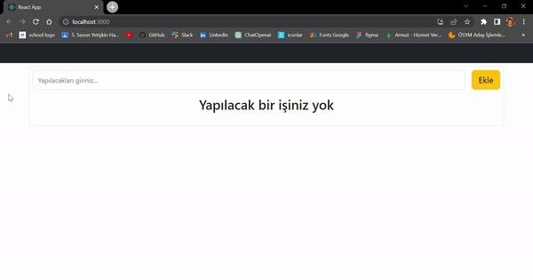

<h1>CRUD App</h1>

Create React Update Delete

Oluştur Oku Güncelle Sil

<ul>
<li>
1- Yeni eklenecek eleman almak için bir form oluştur.
Form içerisinden verileri alıp state ye aktar.
Daha sonra ekle butonuna tıklayınca forma girilen bilgilerle yeni bir öğe oluştur oluşturulan öğede olamsı gereken bilgiler; tarih, todoText, id, yapıldı mı ? şeklinde bir state i olsun ve bir state e aktar.
Form içerisindeki yazılanı aldıktan sonra formu sıfırla.
</li>

<li>
2- State bulunan elemanları al ve map ile listele (ekrana bas)
=>Eğer state içerisinde hiç eleman yoksa ekrana yapılacak bir şey yok yazsın
</li>

<li>
3- Todo silme;
Herhangi bir todonun butonun yanındaki sil butonuna tıklanınca tıklanan todonun id sine göre todos dizisini filtrele ve silineni gösterme
</li>

<li>
4- Todo yu tamamlama:
hangi todonun yapıldı butonuna tıklandıysa o todo yu bul ve isDone değerini tersine çevir
Yapıldı butonunun aktif olarak değişmesini sağla
Yapılan todonun üstünü çiz
</li>

<li>
5- Edit işlemini yap;
Düzenle butonuna basıldığında ekrana bir modal çıksın.
Kullanıcı bu modal üzerinden todo başlığını değiştirebilmesi için bir input butonu olacak.
İnput içerisinde seçilen todonun başlığı yazsın.
Modal üzerinde iptal et ve kaybet butonları olsun.
</li>

<li>
6- Bileşenlere ayırma;
Yeniden kullanabilir yapıları birer component olarak ayır.
</li>
</ul>

<h3>Ekran Gif i ekliyorum</h3>

# ReactTodo
